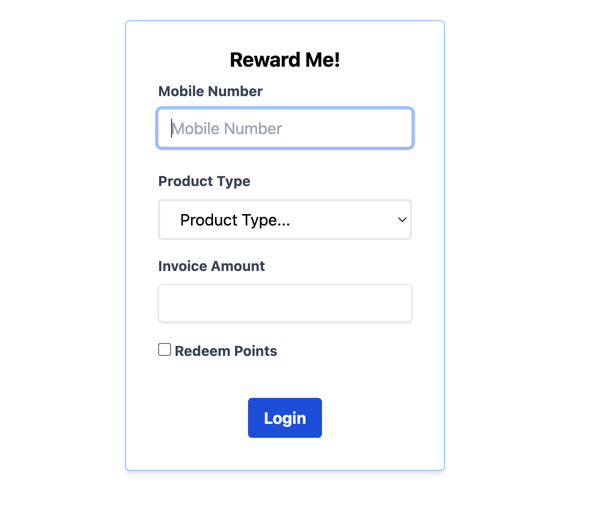
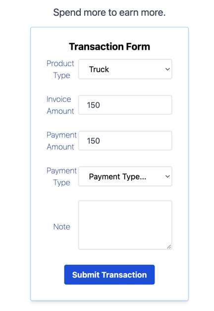

# NOTE: This is WIP and not yet ready for use.

# RewardMe

RewardMe is a simple and easy to use reward system for your business. It is designed to be used in a retail environment,
but can be used in any business that wants to reward their customers for their loyalty.

Idea here is to give points to customers for their purchases, and then they can redeem those points in next purchase.

## How it looks on the customer side

Landin page:

Transaction page:

## TODO: update this file with more details

What's left to do:
Check [TODO.md](TODO.md)
